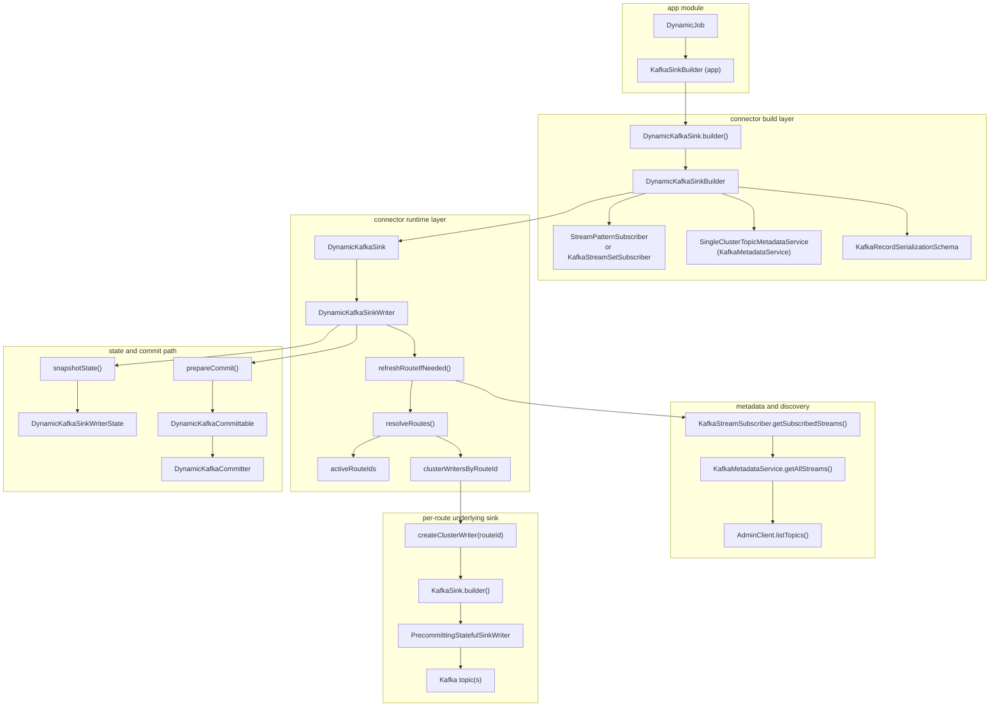

# Dynamic Sink Component Call Graph

This document focuses on component invocation relationships in the current project implementation.

## Component Call Graph

## How to Read This Graph

- `DynamicJob` in `app` builds the sink through the app-level `KafkaSinkBuilder`.
- `DynamicKafkaSinkBuilder` wires subscriber, metadata service, serializer, and creates `DynamicKafkaSink`.
- `DynamicKafkaSinkWriter` is the runtime core:
  - refreshes metadata by interval,
  - resolves available routes,
  - writes each record to all currently active routes.
- Each route gets an internal regular `KafkaSink` writer instance.
- Checkpoint/commit is managed via `DynamicKafkaSinkWriterState` and `DynamicKafkaCommittable`.
